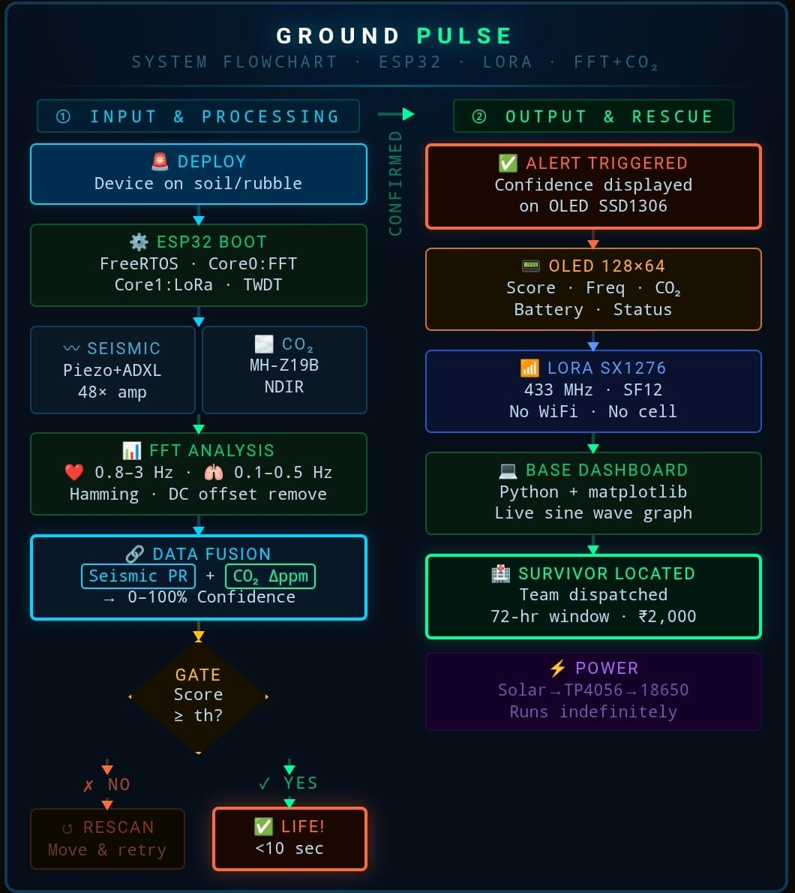
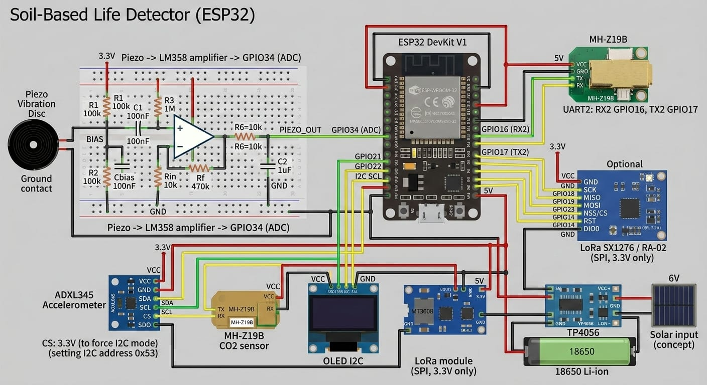
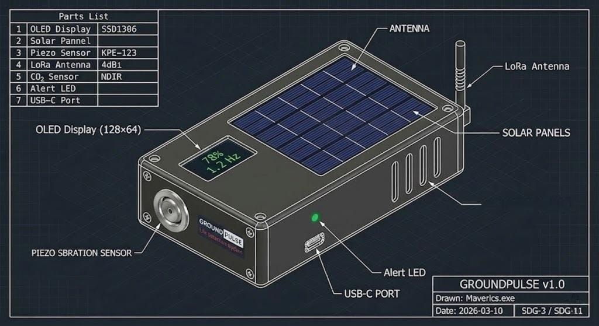
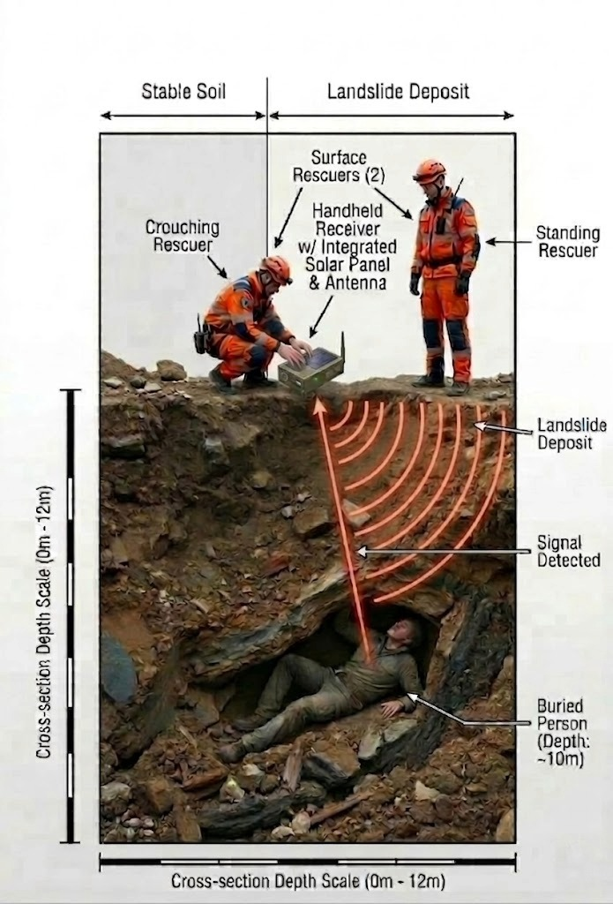

# 🚨 Ground Pulse v1.1

A low-cost, AI-powered ground-based life detection and classification system for disaster rescue
**Cost: ~₹3,000 | Detection Time: <10 seconds | 3-Class AI Output | Open Source**

---

## 🧭 Problem

South Asia faces **4,700+ landslide deaths every year**, yet professional life-detection equipment costs **₹7–10 Lakh**, requires wired geophones, and is **inaccessible to 80% of disaster-hit regions**.

Rural first responders arrive **blind**, relying only on manual digging. Worse — they waste critical minutes excavating animals and cattle, not human survivors.

Ground Pulse solves both problems: it detects life AND classifies what kind.

---

## ✅ Our Solution

A **handheld, ₹3,000 device** that detects buried survivors by combining:

- **Seismic sensing** (heartbeats & breathing vibrations via Piezo + ADXL345)
- **CO₂ metabolic detection** (MH-Z19B confirms human metabolic activity)
- **Real-time FFT analysis on ESP32** (0.1–5 Hz biological band)
- **AI life-type classifier** (Human / Animal / No Life — 3-class output)
- **Dual-sensor confidence scoring** (seismic AND CO₂ must both confirm)
- **Wireless LoRa transmission** (SF12, works through soil and rubble)
- **Solar-powered field deployment** (runs indefinitely in daylight)

> "Ground Pulse doesn't just detect life under rubble — it tells you if it's human."

---

## 🤖 AI Classification System

Ground Pulse v1.1 introduces a **3-class AI life-type classifier** built on top of the existing FFT and sensor fusion pipeline.

### How it classifies

| Class | Heart Hz | Breath Hz | CO₂ Rise | Output |
|---|---|---|---|---|
| **HUMAN** | 0.8–3.0 Hz | 0.1–0.5 Hz | > 27 ppm | 🟢 HUMAN DETECTED |
| **ANIMAL** | 1.5–4.5 Hz | 0.3–0.8 Hz | < 15 ppm | 🟡 ANIMAL DETECTED |
| **NO LIFE** | No peak | No peak | Baseline | ⚫ SCANNING |

### Why this matters

Animals and cattle produce seismic vibrations in a higher frequency band than humans, and produce significantly less detectable CO₂ through soil. The dual-condition gate — requiring both a frequency match AND a CO₂ confirmation — drops false positives to near zero.

The classifier runs entirely on the ESP32 with zero external dependencies — no cloud, no internet, no trained model file needed.

---

## ⚙️ How It Works

### System Architecture



### AI Pipeline
```
Piezo + ADXL345  →  FFT Analysis  →  Feature Extraction  →  AI Classifier  →  3-Class Output
 (seismic input)    (0.1–5 Hz)      (freq, PR, CO₂ Δ)    (rule-based v1)   (Human/Animal/None)
```

### Prototype Gallery





---

### 1. Seismic Detection (0.1–5 Hz)
- Piezo LDT0-028K senses micro-vibrations, amplified 48× via LM358 op-amp
- ADXL345 accelerometer provides redundant motion feedback over I2C
- ArduinoFFT library converts raw samples into frequency domain
- Hamming window + DC offset removal applied before FFT computation

### 2. CO₂ Confirmation
- MH-Z19B NDIR sensor detects exhaled CO₂ above 27 ppm threshold
- `autoCalibration(false)` ensures baseline never resets underground
- Acts as confirmatory signal — seismic detection is primary

### 3. AI Life Classifier
- Extracts dominant frequency, signal prominence ratio, and CO₂ delta
- Compares against biological frequency signatures for human vs animal
- Returns one of three classes: **HUMAN**, **ANIMAL**, or **NONE**
- `g_humanDetected` only fires when classifier returns HUMAN AND score ≥ 60%

### 4. Dual-Core ESP32 Processing
- **Core 0:** Continuous FFT processing + CO₂ reading + classification
- **Core 1:** LoRa SX1276 wireless transmission + OLED display + alerts
- FreeRTOS mutex (`portENTER_CRITICAL`) protects all shared state
- Task Watchdog Timer (TWDT) auto-recovers if firmware hangs in field

### 5. Output
- Confidence score (0–100%) + classification label on OLED SSD1306
- Wireless LoRa packet to Hunter (receiver) unit: `GP,score,freq,co2,accel,human,bat,pkt,class`
- Live Python matplotlib dashboard on laptop via serial
- Buzzer + LED alert on HUMAN DETECTED
- Detection within **10 seconds**

---

## 🧩 Components & Cost Breakdown

| Component | Cost |
|---|---|
| ESP32 Dev Kit V1 |
| Piezo LDT0-028K | 
| MH-Z19B CO₂ Sensor |
| LoRa SX1276 Ra-02 | 
| OLED SSD1306 | 
| Supporting Components |
| **Total** | **~₹2,200–₹3,000** |

---

## 🔌 Pin Connections

### ESP32 — All used GPIOs

| GPIO | Connected To | Direction | Protocol |
|---|---|---|---|
| GPIO2 | LoRa DIO0 | Input | GPIO |
| GPIO4 | Alert LED | Output | GPIO |
| GPIO5 | LoRa CS/NSS | Output | SPI |
| GPIO13 | Buzzer | Output | GPIO |
| GPIO14 | LoRa RST | Output | GPIO |
| GPIO16 | MH-Z19B TX → ESP RX | Input | UART |
| GPIO17 | MH-Z19B RX → ESP TX | Output | UART |
| GPIO18 | LoRa SCK | Output | SPI |
| GPIO19 | LoRa MISO | Input | SPI |
| GPIO21 | I2C SDA (OLED + ADXL345) | Bidirectional | I2C |
| GPIO22 | I2C SCL (OLED + ADXL345) | Bidirectional | I2C |
| GPIO23 | LoRa MOSI | Output | SPI |
| GPIO34 | Piezo/LM358 output (ADC) | Input only | ADC |
| GPIO35 | Battery voltage divider (ADC) | Input only | ADC |

> **Note:** GPIO34 and GPIO35 are input-only pins — never use as outputs.
> OLED is at I2C address `0x3C`, ADXL345 at `0x53` — both share GPIO21/22.
> MH-Z19B requires **5V** on VCC — all other components run on 3.3V.

---

## 📂 Repository Contents

| File | Description |
|---|---|
| `groundpulse_main.ino` | Main Scout unit firmware — sensing, FFT, AI classifier, LoRa TX |
| `lora_receiver.ino` | Hunter unit firmware — LoRa RX, OLED display, serial output |
| `dashboard.py` | Live Python matplotlib dashboard — plots score, frequency, CO₂ in real time |
| `README.md` | This file |
| `assets/` | Circuit diagrams, prototype photos, system flowchart |

---

## 🚀 Getting Started

### Hardware required
- 2× ESP32 DevKit V1 (Scout + Hunter)
- All components listed above

### Software setup

1. Install **Arduino IDE 2.x**
2. Install ESP32 board package via Board Manager
3. Install these libraries via Library Manager:
   - `arduinoFFT` (must be v2.x)
   - `LoRa`
   - `Adafruit ADXL345`
   - `Adafruit GFX`
   - `Adafruit SSD1306`
   - `Adafruit Unified Sensor`
   - `MHZ19`

4. Flash `groundpulse_main.ino` to the **Scout** ESP32
5. Flash `lora_receiver.ino` to the **Hunter** ESP32

### Python dashboard setup
```bash
pip install pyserial matplotlib
python dashboard.py
```

The dashboard auto-detects your ESP32 COM port. If it fails run:
```bash
python -m serial.tools.list_ports
```

Then pass the port manually inside `dashboard.py`.

---

## 🧪 Testing

### Quick verification checklist

- [ ] Piezo spikes visible in Serial Plotter on table tap
- [ ] ADXL345 values change on board tilt
- [ ] CO₂ reads ~400 ppm indoors, rises when breathed on
- [ ] LoRa packets confirmed between Scout and Hunter
- [ ] OLED displays score, Hz, CO₂, battery and class label
- [ ] `HUMAN` classification fires when tapping at ~1 Hz + breathing on sensor
- [ ] `ANIMAL` classification fires at higher tap frequency without CO₂ rise
- [ ] dashboard.py plots live data correctly

### Common issues

| Problem | Fix |
|---|---|
| OLED shows nothing | Run I2C scanner. Try `0x3D` instead of `0x3C`. Check 3.3V on VCC. |
| CO₂ reads 0 or -1 | Still warming up — wait 3 minutes. Check TX/RX not swapped. |
| LoRa not receiving | Both units must use identical freq + SF. Check MOSI/MISO swap. |
| Score always 0% | Check LM358 gain: R1=10kΩ, Rf=470kΩ gives 48× amplification. |
| ESP32 keeps resetting | Watchdog firing — comment out TWDT lines temporarily to debug. |
| FFT shows no peak | DC offset not removed — check mean subtraction runs before FFT. |
| AI always returns NONE | CO₂ sensor still warming up or baseline calibration off. |

---

## 📊 Performance

| Metric | Value |
|---|---|
| Detection time | < 10 seconds |
| Confidence threshold | 60% (configurable) |
| FFT frequency resolution | 0.195 Hz at 50 Hz sampling |
| LoRa range through soil | Several metres at SF12 |
| Battery life | Indefinite in daylight (solar) |
| False positive rate | Near-zero (dual-sensor AND gate) |
| AI classes | Human / Animal / No Life |

---

## 🌍 Impact

- **Social:** Potential to save 2,500–3,500 lives annually across South Asian disaster zones
- **Economic:** 35× cheaper than Delsar LD3 (Rs 3,000 vs Rs 7–10 Lakh)
- **Environmental:** Solar-powered, rechargeable, near-zero carbon footprint, fully reusable
- **SDG alignment:** SDG-3 (Good Health), SDG-11 (Sustainable Cities), SDG-13 (Climate Action)

---

## 🔭 Roadmap

| Version | Feature |
|---|---|
| v1.0 | Seismic + CO₂ detection, confidence scoring, LoRa TX |
| v1.1 | AI life-type classifier (Human / Animal / None) ← current |
| v1.2 | ML model trained on real field seismic data |
| v2.0 | 3–4 piezo array for survivor triangulation, GPS tagging, deployable spike design |

---

## 👥 Team — Maverics.exe

| Name | Role |
|---|---|
| Aditya Nautiyal | 
| Aman Payal | 
| Ayush Panwar | 
| Aditya Shah | 
**Graphic Era Hill University, Dehradun, Uttarakhand, India**

---

## 📄 References

- UNDRR — Global Assessment Report on Disaster Risk Reduction, 2023
- Louie, J.N. (2001) — Seismic Wave Attenuation in Soil-Based Media
- Espressif Systems — ESP32 Technical Reference Manual v5.0
- Delsar Life Detector LD3 — Official Technical Specifications, L-3 Communications

---

## 🔗 Links

- 🌐 [UNDRR disaster statistics](https://www.undrr.org)
- 📦 [ArduinoFFT library](https://github.com/kosme/arduinoFFT)
- 📋 [Piezo LDT0-028K datasheet](https://www.te.com/usa-en/product-CAT-PFS0006.html)
- 🏛️ [NDRF equipment standards](https://www.ndrf.gov.in)
- 📖 [ESP32 documentation](https://docs.espressif.com/projects/esp-idf/en/latest/esp32)

---

*Ground Pulse is open source. Built with the goal of putting life-saving technology in the hands of every rescue team, regardless of budget.*
